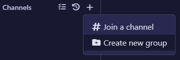
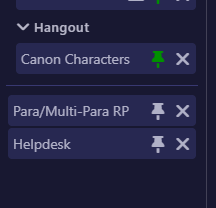
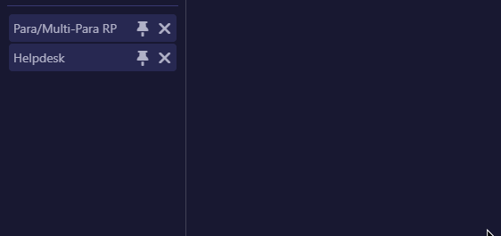
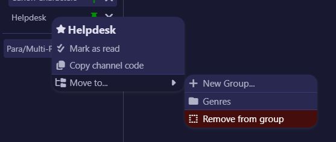
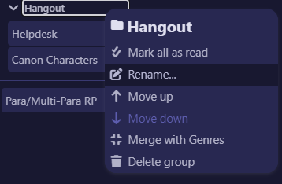
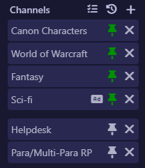

# Channel Groups

Introduced in version 2.2.0, channel groups are an expansion of the channel pinning system that allows you to group channels into categories that you can rename, collapse, and reorganize as you see fit.

> [!INFO]
> If you previously pinned channels, Horizon automatically moves them into a group for you the first time you open the new version. Nothing is lost, and they'll function the same as they used to.

## Creating a group

Click the **+** button at the top of the channel list and choose **Create new group**. A new group called will appear with its name ready to edit, which you can save by hitting `Enter`.

## Adding and removing channels from groups

To put a channel in a group, **click and drag it** from the channel list and drop it onto the group. You'll see a highlight showing around the group you'll be dropping the channel into.

Alternatively, you can right click the channel to show a context menu to select the group.

To remove a channel from a group, **click and drag it** away from the group or use the right click context menu.

## Renaming a group

There are two ways to rename a group:

- **Double-click** the group's name, type the new name, and press `Enter`.
- **Right-click** the group header and choose **Rename...**

Press `Esc` while editing to cancel without changing the name.

## Deleting a group

Choose **Delete group** from the right-click menu (or click the trash icon on the group header). If the group still has channels in them, Horizon asks you to confirm first.

> [!TIP]
> Deleting a group never makes you leave any channels. The channels simply move back out to the ungrouped area, you can re-group them whenever you like.

## Do my groups stick around?

Yes. Your groups, their names, their order, which channels are in them, and whether each one is collapsed are all **saved automatically** and restored the next time you open Horizon, similarly to how pinned channels have worked in the past.

## What if I just want my classic pinned channels?

That's totally fine, you don't need to create a group at all! Simply clicking the pin/unpin button without creating a group will pin it just like you remember it. The only change you'll notice in this update is that the pinned channels are visually separated from unpinned channels. You will only see the group headers themselves once you create a second group.

