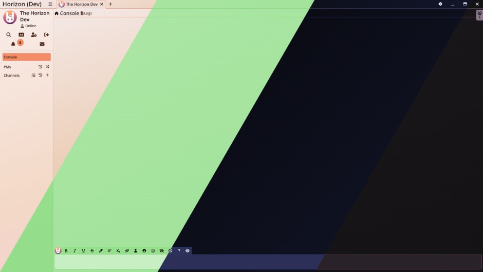
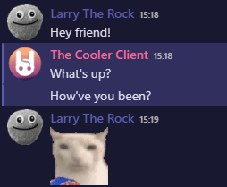
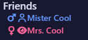
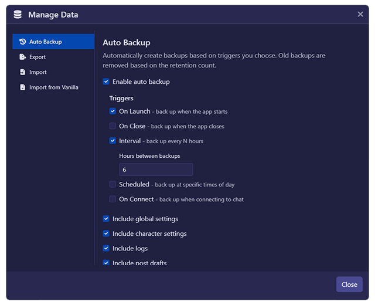
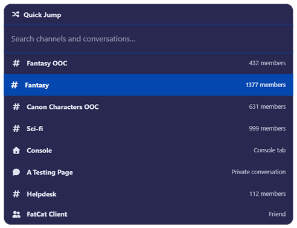
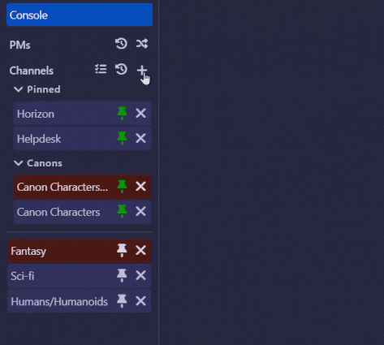
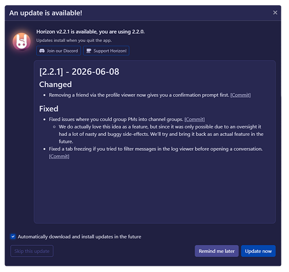

# Features

Horizon contains a lot of features compared to the vanilla 3.0 F-Chat client— A lot of which can be disabled if you don't want them! See the sections below for a non-exhaustive list.

Check out the general [quality of life changes](quality-of-life) while you're at it too. Come from Rising? [We've improved some of those features too](#rising-features).

## More customization

Horizon comes with a whole bunch of extra themes— that you can even sync with your computer's light/dark mode, to give you something that really suits your tastes. Not enough options? You can even write your own custom CSS to style everything _just_ the way you like it. Additionally, there's different sound themes you can choose as well, in case you want something a little more pleasant to listen to.

You can even pick various sound themes for your notifications and, in the future, make your own sound packs with ease.

### Different View Modes

Tired of the compact, old-school layout for the chat, and craving something more modern, similar to Discord? Horizon has a setting for that!

### Gender Icons

For users who want an easier way to know the gender of the character they're talking to, Horizon has a toggle to show the gender icon next to characters' names!

## Log Backups

Horizon has a built-in, automatic log backup system. You can set it to run as soon as you open/close the app, at specific intervals, or at specific times of the day, and you can choose which characters are backed up and what exactly is backed up from those characters. These settings can be setup within the **Manage Data** menu.

## Quick Jumper

Press `Ctrl + T` to open the Quick Jump modal! This will let you quickly jump to a specific channel, conversation, open a new PM, or find one of your friends, all from one convenient keyboard shortcut.

## Channel Grouping

In addition to the existing way of pinning channels, you're able to **group** your pinned channels with Horizon, letting you categorize them however you see fit without any loss in functionality. [Read more about it here!](channel-groups)

## Automatic Updates

Horizon has a built in updater along with an (optional) automatic update process, meaning you'll get the latest enhancements in a streamlined manner.

## Custom Character Colors & High Quality Portraits

Want high quality portraits? Simply place `[url=link.to.url.com]Horizon Portrait[/url]` in your characters bio. Want a custom color? Do `[color=colorname]Horizon Color[/color]` to set one as well!

See [the dedicated guide](guides/colors-and-avatars) for more information.

## Rising Features

Horizon is a continuation of the now defunct F-Chat Rising client, which itself is a customized fork of the standalone 3.0 client. Because of that, all of the cool features (except that not-so-cool one) are all part of Horizon too! We've retooled some of those as well:

### In-app Note and Message Notifications

Horizon can show you the number of notes and character notifications you've received, updating automatically whenever a new one comes in. Just click the counter to be brought right to your notifications on the site!

### Status History

You can pin any status you've used to your list of statuses to select from, so you don't have to keep tabs on whether it's about to drop out. On that note, you can see how many statuses you have left until old ones are automatically cleared out, but we've also increased the limit to 15.

### Character and Link Previews

Hover your mouse over a link that someone has sent you, and you'll be able to see a preview of the website! With time, many sites had their previews slowly stop working in Rising, but we've kept the list a lot more up to date so that more links work as intended.

> [!INFO]
> Link shortener URLs (tinyurl, bitly, etc.) will not show a preview when hovered over for security reasons.

### Character Matching

The profile analyzer that helps you get better matching results has now been worked into your own profile, instead of being shoved into the sidebar in the main chat view. Additionally, you can set filters to hide or automatically reject characters you aren't a match with, so you can focus on the characters that **are** a match for you.

For the future, we also have plans to adjust the matcher to user feedback, though one important change we already implemented means that nonbinary characters are no longer automatically considered a negative match for people who did not specifically select that gender as a default kink.

### EIcon Selector and Color Picker

There's an integrated EIcon search to find whichever silly icon matches your current mood/action, and you can right-click any EIcon you see in the wild to easily save it to your list of favorites. The color picker has also been upgraded with an auto-completing keyboard shortcut.

### Automatic Ads

After writing up your ad(s), Horizon can automatically post those ads for you in your channels, taking away the need to manually post ads repeatedly. You can pick how often they post so that you're not constantly spamming channels, and you can specify which types of ads will post to which channels in case you have different things you're looking for in each room.
