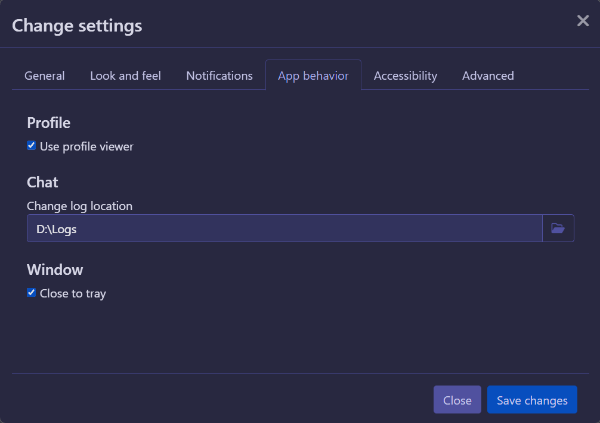

# Backing up your data

> [!INFO]
> These screenshots are all taken on Windows 11, but the process is the same on all platforms. It's just that the majority of our users are on Windows.

## Where are my logs even?

If you've already read [this guide](./moving-from-rising) on how to import your logs from Rising, you'll know that the default location of the logs is somewhere in your user data or home folder. But this location is actually something you can configure yourself in the app's global settings, you can even easily view the exact folder here:

If you have separate drives or partitions on your computer, it's a good idea to save your logs there. Otherwise, keeping them in a folder you can more easily access (like your Desktop) isn't a bad alternative either.

> [!INFO]
> Changing the log directory does _not_ move the logs you have already saved though. If you don't move them yourself, you won't be able to use them in the app until you either do, or you set the log location back to the old value.

While the default location will have some files next to your character folders, like `eicons.json` or `settings`, you do not need to move these with your logs. They just happen to be saved in the same folder.

## How do I back them up?

Still logged into a character? Now is a good time to log off until you're done.

Backing up your logs is actually pretty simple; All you need to do is make a different folder for you to copy the logs to. Now that you also know where your logs are normally saved, you can just copy the folders for your characters to this new folder, the same way you'd copy and paste any other file. Your logs folder will probably look something like this:

If you need to restore this old backup for whatever reason, you can just do the inverse and paste the folders from your backup into the actual log folder.

### Extra info

Note that conversations are stored in a single file per partner or channel (ie. if your profile is called "Freddy", your logs for your conversation with a character called "Michael" will be saved in the files `Freddy/logs/michael` and `Freddy/logs/michael.idx`. This means that you can't "merge" two log files for the same conversation partners together, and can only overwrite them.

Logs for public rooms (the ones made by users, not staff) are stored with their code name instead of the channel name, usually starting with `#adh-`. This is because people can technically make multiple rooms with the same name, and this is how F-List's server tracks them. This is kind of confusing, but it's also the only way we can actually make sure that the logs you see when you rejoin a channel are actually from that same channel.
