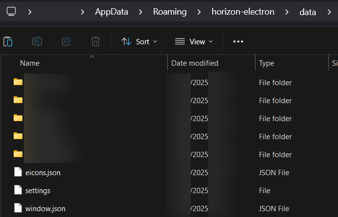

# Backing up your data

> [!INFO]
> These screenshots are all taken on Windows 11, but the process is the same on all platforms. It's just that the majority of our users are on Windows.

## Recommended: Using the Exporter

Horizon includes a built-in exporter tool that makes backing up your data straightforward. This is the **recommended method** for most users as it handles everything automatically.

### Quick Start

1. Open the Horizon menu (hamburger icon), found in the top left next to the window title
2. Go to `Horizon → Export Horizon Data`
3. Select which data types and characters to include
4. Click the export button
5. Your backup is saved as `horizon-export-YYYY-MM-DDTHH-MM-SS.zip` in your Downloads folder

For detailed information, see the [Exporter & Importer](../exporter-importer.md) guide.

## Manual Backup (Alternative)

If you prefer to manually manage your backup files instead of using the exporter, you can do so by directly copying your data folders.

### Where are my logs even?

If you've already read [this guide](./moving-from-rising) on how to import your logs from Rising, you'll know that the default location of the logs is somewhere in your user data or home folder. But this location is actually something you can configure yourself in the app's global settings, you can even easily view the exact folder here:

If you have separate drives or partitions on your computer, it's a good idea to save your logs there. Otherwise, keeping them in a folder you can more easily access (like your Desktop) isn't a bad alternative either.

> [!INFO]
> Changing the log directory does _not_ move the logs you have already saved though. If you don't move them yourself, you won't be able to use them in the app until you either do, or you set the log location back to the old value.

While the default location will have some files next to your character folders, like `eicons.json` or `settings`, you do not need to move these with your logs. They just happen to be saved in the same folder.

### How do I manually back them up?

> [!TIP]
> The exporter/importer tool (described above) is a better solution for most users as it handles everything automatically. Use this method only if you have a reason to.

Still logged into a character? Now is a good time to log off until you're done.

Backing up your logs is actually pretty simple; All you need to do is make a different folder for you to copy the logs to. Now that you also know where your logs are normally saved, you can just copy the folders for your characters to this new folder, the same way you'd copy and paste any other file. Your logs folder will probably look something like this:

If you need to restore this old backup for whatever reason, you can just do the inverse and paste the folders from your backup into the actual log folder.

### Extra info

Your log location can affect how smooth the app runs. If you're saving your logs to a very slow USB drive, you might experience a lot of slowdown when certain channels are becoming more or less active. OneDrive on Windows has been known to be very problematic for this, so if you want to use that to safeguard your logs, you should probably backup your logs to there instead of setting OneDrive as your log folder in Horizon's settings!

Note that conversations are stored in a single file per partner or channel (ie. if your profile is called "Freddy", your logs for your conversation with a character called "Michael" will be saved in the files `Freddy/logs/michael` and `Freddy/logs/michael.idx`. This means that you can't "merge" two log files for the same conversation partners together, and can only overwrite them.

Logs for public rooms (the ones made by users, not staff) are stored with their code name instead of the channel name, usually starting with `#adh-`. This is because people can technically make multiple rooms with the same name, and this is how F-List's server tracks them. This is kind of confusing, but it's also the only way we can actually make sure that the logs you see when you rejoin a channel are actually from that same channel.
