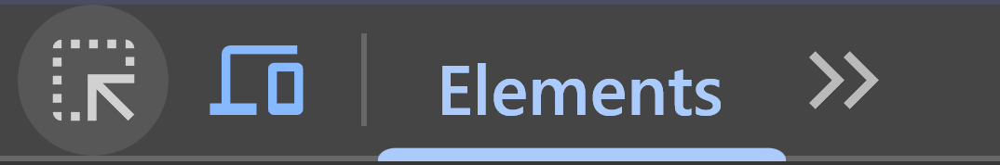
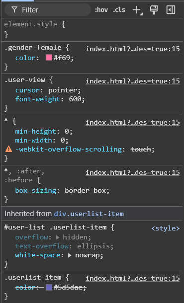

# Custom User Styles

> [!INFO]  
> Custom user styles support is still in an early state. Though all of the functionality should be accounted for, some of the nicer quality of life features (like syntax highlighting, or live previews) have yet to be implemented.

## Overview

Since version 1.33.0, Horizon has support for custom styling through CSS. This gives you an extremely powerful tool to completely transform the look and feel of the client far beyond any of the preset options we give you could. But since this is basically a developer tool, CSS styling can be quite complex to learn and to explain the full breadth of options that CSS unlocks for you would be its own course in and of itself.

If you're looking for good resources on the possibilities that CSS unlocks for you, check out [this](https://www.w3schools.com/Css/) guide on the W3Schools website.

## Where to use

As of writing, the option to enable and use custom CSS is under the "Advanced" tab in the "Preferences" window for the app— either under "Horizon > Preferences" or by clicking the cog icon on the top right.

Simply check the "Use custom CSS" box and your custom styles can be entered in the text field below. Pressing the "Save changes" button applies them, and going back to the app settings and unchecking the box lets you disable your styles without deleting them.

## Basics of selectors

In order to know what elements on a page styles need to apply to, CSS uses _selectors_. More advanced options exist than these, and can be read about [here](https://www.w3schools.com/cssref/css_selectors.php), but the basic ones work as follows:

| Selector | Code          | What's it for?                                                                                                                                                                                                                                                          |
| -------- | ------------- | ----------------------------------------------------------------------------------------------------------------------------------------------------------------------------------------------------------------------------------------------------------------------- |
| Class    | `.class-name` | Generically styled items whose style rules aren't meant to apply to every instance of the HTML tag. For example, most buttons will have the `.btn`, and `.btn-primary` or `.btn-secondary` classes. This way, they'll all use the same features like colours and sizes. |
| ID       | `#id-name`    | Unique elements that are only supposed to appear once on the entire page. For example, the user list on the right has the id `#user-list`, so any styles applied to that selector will only apply to that specific element.                                             |
| Tag      | `sub`         | For every instance of a specific [HTML tag](https://www.w3schools.com/html/html_elements.asp). For example, the BBCode tags for `[sub]` and `[sup]` are parsed to `sub` and `sup` HTML tags.                                                                            |

### Combining selectors

Selectors can be combined as well through [combinators](https://www.w3schools.com/cssref/css_ref_combinators.php), this will let you make CSS rules with more specificity. Take the following example:

```css
.bbcode-editor .bbcode-toolbar .character-btn {
  width: 30px;
  height: 30px;
  overflow: hidden;
}
```

This is a real bit of CSS used in the app, which simply makes it so that any instance of a `.character-btn` class inside a `.bbcode-toolbar` class, which is inside _another_ `.bbcode-editor` class will be sized to 30 by 30 pixels. It's the little icon of your own character next to the BBCode editor buttons!

Now watch what happens when we enter the following custom CSS:

```css
.bbcode-editor .bbcode-toolbar .character-btn {
  width: 80px;
  height: 80px;
}
```


The icon has grown _really_ big!

## Making our first custom style

### The plan

For our first custom style, we will try the following things:

- We want to set the font the app uses to one we find easier to read: Comic Sans MS.
- Female characters in the userlist to the right should be coloured (and ONLY in this list!) with a brighter shade of pink, because we want them to stand out more.
- Eicons are sometimes a bit too small for us to see, so we'll make them full size.
- We want `[sub]` and `[sup]` BBCode tags to use the regular text size.

### Finding the selectors

If you want to find out what the right selectors are for a specific element, the Inspect Element tool is essential. In order to use it, you will need to open the Developer Tools by pressing CTRL+Shift+I (or Cmd+Shift+I on Mac). Once you do, you'll be greeted with a window similar to this. Be sure to click the "Elements" tab on the top row!


On the top left, you should then see a button like the one below.



By clicking it, you enter "Inspect Element" mode, and moving the mouse cursor around will show various rectangles for the page elements you are hovering over.


Now when you click an element in this mode, the pane on the right side of the dev tools will show the CSS rules that are currently applied to the element you just clicked.



So, for example, if we want to apply a style to female character names, we can use the `.gender-female` selector.

### Figuring out our rules

Still with us? We're almost there. We know how to find the specific names of an element's classes and IDs now, so I'll give you a quick spoiler on what the other selectors from our initial list were:

| Item                      | Selector                                                                           |
| ------------------------- | ---------------------------------------------------------------------------------- |
| Page body (for the font)  | `#page`                                                                            |
| Female character names    | `.gender-female`                                                                   |
| Eicons                    | `.character-avatar.icon` (this is shared with instances of the `[icon]` BBCode tag |
| Sub- and superscript tags | `sub` and `sup`                                                                    |

Now if you remember the CSS examples from earlier, that means that if we want to make styles for these items, the CSS would have to be structured like this:

> [!NOTE]
> Code between `/*` and `*/` is ignored by CSS. They're used for comments inside your code.

```css
#page {
  /*
    The singular element labelled with the ID "page".
    */
}

#user-list .gender-female {
  /*
    The space between the ID and the class names means
    that the rule will apply to every instance of 
    .gender-female inside the #user-list, but none outside of it.
    */
}

.character-avatar.icon {
  /*
    Without a space between these two classes, 
    it will select elements that have BOTH classes, but not 
    if they only have one of them.
    */
}

sub,
sup {
  /*
    The same rule will apply to both sub and sup elements (hence
    the comma).
    These are not class names, but rather HTML tags. So they
    do not get a . or a #
    */
}
```

As for the actual rules we will apply, we use the following:

```css
#page {
  font-family: "Comic Sans MS";
}

#user-list .gender-female {
  color: #ff1493;
  font-weight: bold;
  /*
    A very bright pink, that is now fully bold.
    */
}

.character-avatar.icon {
  width: 100px;
  height: 100px;
}

sub,
sup {
  font-size: 1em;
  /*
    'em' sets a size to the relative font size for its parent. So 1em means that it will have the regular font size.
    */
}
```

And voila!:


Maybe it won't look great, but it will be *yours* and catered to your specific needs and wants.

### Further reading

For more info on the specific rules we picked, check these pages out:

- [font-family](https://www.w3schools.com/cssref/pr_font_font-family.php)
- [color](https://www.w3schools.com/cssref/pr_text_color.php)
- [width](https://www.w3schools.com/cssref/pr_dim_width.php)
- [height](https://www.w3schools.com/cssref/pr_dim_height.php)
- [font-size](https://www.w3schools.com/cssref/pr_font_font-size.php)

Some more useful information:

- [CSS colors](https://www.w3schools.com/cssref/css_colors_legal.php)
- [CSS size units](https://www.w3schools.com/cssref/css_units.php)
- [CSS rules](https://www.w3schools.com/cssref/index.php)
