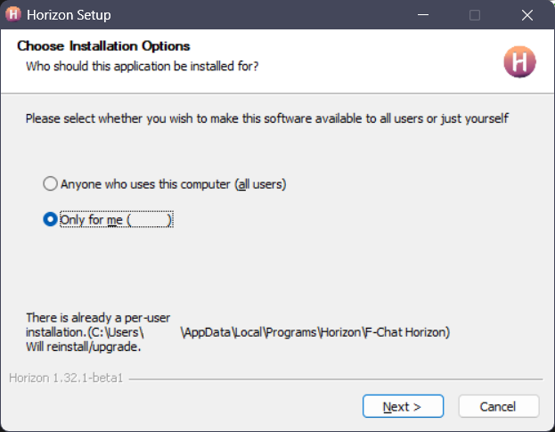
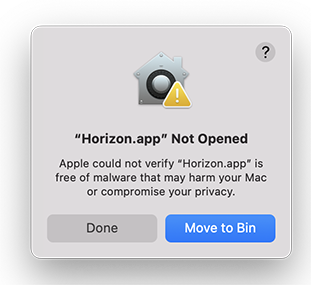
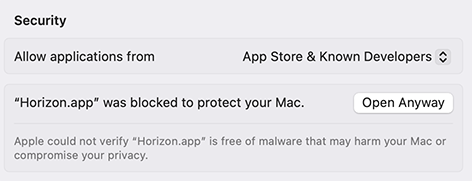
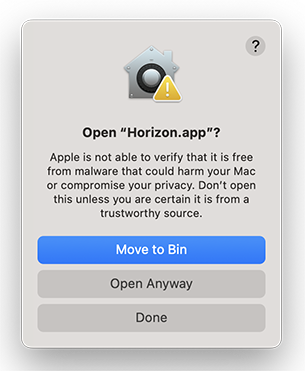

# Installing Horizon

The installer for your platform of choice can be downloaded from either the [download](../../download) page, or from the [GitHub repository's releases page](https://github.com/Fchat-Horizon/Horizon/releases/tag/v1.32.0). On the latter, you can also download older versions or ones for a different platform.

Hopping over from Rising? Check out [this guide](moving-from-rising) on migrating your data.

## Windows

On Window, simply running the downloaded installer .exe file should be enough. Following the instructions, Horizon can either be installed globally, or for your specific user only (recommended).



On an ARM device like a Microsoft Surface? A native ARM version should be available for you too.

## Linux

###

| Distro                                                                                                      | Info                                                                                                                                     | Maintainer(s)              |
| ----------------------------------------------------------------------------------------------------------- | ---------------------------------------------------------------------------------------------------------------------------------------- | -------------------------- |
|        | [link](https://github.com/Fchat-Horizon/gentoo/tree/0dbb49c0a2010d9a1813b5495fb78e1178494b14)                                            | @CodingWithAnxiety         |
|  | [](https://repology.org/project/fchat-horizon/versions) | astrayblackcat, KenwoodFox |
|        | [Available under releases](https://github.com/Fchat-Horizon/Horizon/releases/latest)                                                     | The Horizon Developers     |

Feel like an option tailored to your distro of choice is missing? Don't be shy and request, or even contribute it on our [GitHub](https://github.com/Fchat-Horizon/Horizon).

### AppImage

1. Download the AppImage for your architecture:
   - [Linux x64 .AppImage](https://github.com/Fchat-Horizon/Horizon/releases/latest/download/F-Chat.Horizon-linux-x86_64.AppImage)
   - [Linux arm64 .AppImage](https://github.com/Fchat-Horizon/Horizon/releases/latest/download/F-Chat.Horizon-linux-arm64.AppImage)
2. Make it executable, then run:
   ```bash
   chmod +x F-Chat.Horizon-linux-<arch>.AppImage
   ./F-Chat.Horizon-linux-<arch>.AppImage
   ```

### Debian/Ubuntu (deb)

1. Download the `.deb` file for your architecture.
   - [Linux x64 .deb](https://github.com/Fchat-Horizon/Horizon/releases/latest/download/F-Chat.Horizon-linux-amd64.deb)
   - [Linux arm64 .deb](https://github.com/Fchat-Horizon/Horizon/releases/latest/download/F-Chat.Horizon-linux-arm64.deb)
2. Install:
   ```bash
   sudo dpkg -i F-Chat.Horizon-linux-<arch>.deb
   ```

### Tarball (tar.gz)

1. Download the `.tar.gz` for your architecture:
   - [Linux x64 .tar.gz](https://github.com/Fchat-Horizon/Horizon/releases/latest/download/F-Chat.Horizon-linux-x64.tar.gz)
   - [Linux arm64 .tar.gz](https://github.com/Fchat-Horizon/Horizon/releases/latest/download/F-Chat.Horizon-linux-arm64.tar.gz)
2. Extract and run:
   ```bash
   tar -xzf F-Chat.Horizon-linux-<arch>.tar.gz
   cd F-Chat.Horizon-linux-<arch>
   ./F-Chat.Horizon
   ```

### Arch-based (AUR)

> [!NOTE]
> The AUR package currently doesn't support ARM.

- With an AUR helper:
  ```bash
  yay|paru|etc -S fchat-horizon-bin
  ```
- Manually:
  ```bash
  git clone https://aur.archlinux.org/fchat-horizon-bin.git
  cd fchat-horizon-bin
  makepkg -si
  ```

## MacOS

On macOS, installing or updating is as simple as opening the downloaded .dmg file and dragging the app icon into the Applications folder.


You might see a warning like this, telling you that Apple could not verify whether the app is free of any malware. This is because macOS's [Gatekeeper](https://support.apple.com/guide/security/gatekeeper-and-runtime-protection-sec5599b66df/web) by default blocks apps that haven't been signed and notarized by Apple. This would cost us $99 per year though, so in the meantime you will have to manually allow it through the system settings like so:

1. If this warning pops up, click "Done". 
2. In the System Settings app, go to the "Privacy & Security" settings category on the left, and then scroll down to "Security". Click on "Open Anyway". 
3. In the final popup, click "Open Anyway" again and it should start as normal, 

This unfortunately has to be done for every installed update, though it should be a relatively easy process. If you don't want to take our word on whether or not the app is safe, you could always use a third-party virus scanner like MalwareBytes.

If you'd want to donate a signing certificate, or the funds for one (to save other MacOS users the hassle), feel free to [contact](../../contact) us.
