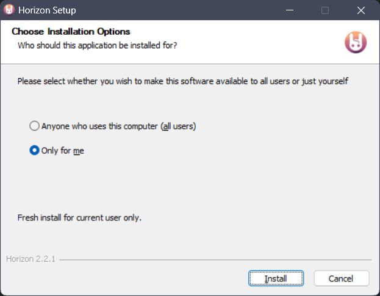
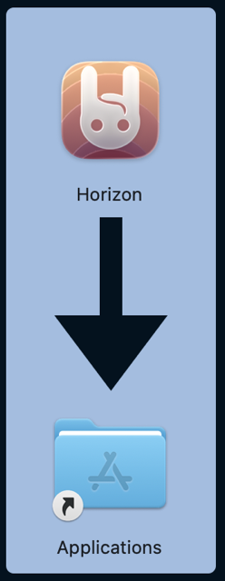

# Installing Horizon

The installer for your platform of choice can be downloaded from the [download](../../download) page, where you'll find packages for every platform and architecture. Older versions are available on the [GitHub releases page](https://github.com/Fchat-Horizon/Horizon/releases).

Hopping over from Rising? Check out [this guide](moving-from-rising) on migrating your data.

## Windows

On Window, simply running the downloaded installer .exe file should be enough. Following the instructions, Horizon can either be installed globally, or for your specific user only (recommended).



On an ARM device like a Microsoft Surface? A native ARM version should be available for you too.

## Linux

###

### Supported distros

| Distro                                                                                                                                                                                                                    | Info                                                                                                                                     | Maintainer(s)                                  |
| ------------------------------------------------------------------------------------------------------------------------------------------------------------------------------------------------------------------------- | ---------------------------------------------------------------------------------------------------------------------------------------- | ---------------------------------------------- |
|                                                                                                                      | [link](https://github.com/Fchat-Horizon/gentoo/tree/0dbb49c0a2010d9a1813b5495fb78e1178494b14)                                            | @CodingWithAnxiety                             |
|  <br>  | [](https://repology.org/project/fchat-horizon/versions) | astrayblackcat, KenwoodFox, @CodingWithAnxiety |
|  <br>           | [Available under releases](https://github.com/Fchat-Horizon/Horizon/releases/latest)                                                     | The Horizon Developers                         |
|  <br>  | [Available under releases](https://github.com/Fchat-Horizon/Horizon/releases/latest)                                                     | The Horizon Developers                         |
|                                                                                                          | [link](https://codeberg.org/akatsukilevi/fchat-horizon)                                                                                  | @akatsukilevi                                  |
|                                                                                                                           | [Flake Below](#nixos)                                                                                                                    | The Horizon Developers                         |

### Additional installation instructions

#### Debian/Ubuntu (deb)

1. Download the `.deb` file for your architecture from the [latest release](https://github.com/Fchat-Horizon/Horizon/releases/latest).
   Look for `F-Chat.Horizon-*-linux-amd64.deb` (x64) or `F-Chat.Horizon-*-linux-arm64.deb` (arm64).
2. Install (replace "`<arch>`" with the architecture from the downloaded filename):
   ```bash
   sudo dpkg -i F-Chat.Horizon-linux-<arch>.deb
   ```

#### Fedora/RPM-based (rpm)

1. Download the `.rpm` file for your architecture from the [latest release](https://github.com/Fchat-Horizon/Horizon/releases/latest).
   Look for `F-Chat.Horizon-*-linux-x86_64.rpm` (x64) or `F-Chat.Horizon-*-linux-aarch64.rpm` (arm64).
2. Install using your package manager (replace "`<arch>`" with the architecture from the downloaded filename):
   - **Fedora/RHEL/CentOS:**
     ```bash
     sudo dnf install F-Chat.Horizon-linux-<arch>.rpm
     ```
   - **openSUSE:**
     ```bash
     sudo zypper install F-Chat.Horizon-linux-<arch>.rpm
     ```
   - **Generic RPM:**
     ```bash
     sudo rpm -i F-Chat.Horizon-linux-<arch>.rpm
     ```

##### NixOS

Horizon is available as a Nix Flake input based on the GitHub repo. See [this](https://nix.dev/manual/nix/2.28/command-ref/new-cli/nix3-flake.html#flake-inputs) page for more information.

```nix
    horizon = {
      url = "github:Fchat-Horizon/Horizon?ref=main";
      inputs.nixpkgs.follows = "nixpkgs-unstable";
    };
```

You can then reference this input as a System Package or user-specific package:

```nix
      environment.systemPackages = [
        inputs.horizon.packages.\${pkgs.system}.horizon-electron
      ];
```

By default this flake input points to `main` as its source branch, which is what we use for _stable releases_. If you want to follow the beta update track, or use nightly builds, replace `main` with `beta` or `development` respectively in the `?ref=<source>` URL parameter for the Flake input.

#### AppImage

1. Download the AppImage for your architecture from the [latest release](https://github.com/Fchat-Horizon/Horizon/releases/latest).
   Look for `F-Chat.Horizon-*-linux-x86_64.AppImage` (x64) or `F-Chat.Horizon-*-linux-arm64.AppImage` (arm64).
2. Make it executable, then run (replace "`<arch>`" with the architecture from the downloaded filename):
   ```bash
   chmod +x F-Chat.Horizon-linux-<arch>.AppImage
   ./F-Chat.Horizon-linux-<arch>.AppImage
   ```

#### Tarball (tar.gz)

1. Download the `.tar.gz` for your architecture from the [latest release](https://github.com/Fchat-Horizon/Horizon/releases/latest).
   Look for `F-Chat.Horizon-*-linux-x64.tar.gz` (x64) or `F-Chat.Horizon-*-linux-arm64.tar.gz` (arm64).
2. Extract and run (replace "`<arch>`" with the architecture from the downloaded filename):
   ```bash
   tar -xzf F-Chat.Horizon-linux-<arch>.tar.gz
   cd F-Chat.Horizon-linux-<arch>
   ./F-Chat.Horizon
   ```

#### Arch-based (AUR)

> [!NOTE]
> The AUR package currently doesn't support ARM.

> [!NOTE]
> The AUR package is not directly maintained by the Horizon team. If you have any issues with it, please check if they can be reproduced in an official build first before reporting them.

- With an AUR helper:
  ```bash
  yay|paru|etc -S fchat-horizon-bin
  ```
- Manually:
  ```bash
  git clone https://aur.archlinux.org/fchat-horizon-bin.git
  cd fchat-horizon-bin
  makepkg -si
  ```

## From Source

If you want to compile and install Horizon from the source code yourself, please see the build and packaging instructions in the [contributing document](../contributing).

## MacOS

On macOS, installing or updating is as simple as opening the downloaded .dmg file and dragging the app icon into the Applications folder.


