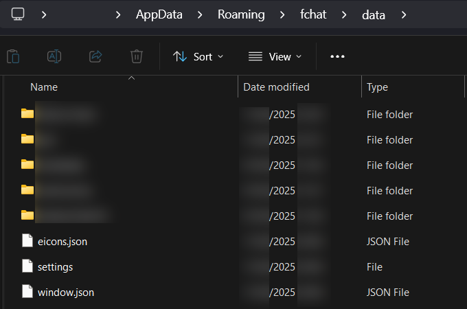
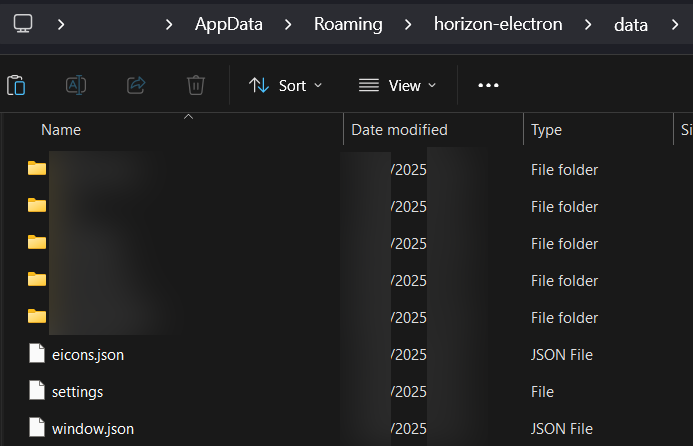

# Moving logs from Rising

## Folder locations

By _default_, F-Chat 3.0 and Rising store their data in the following folders:

| **Operating System** | **Data Path**                         |
| :------------------- | :------------------------------------ |
| Windows              | `%AppData%\fchat`                     |
| MacOS                | `~/Library/Application Support/fchat` |
| Linux                | `~/.config/fchat`                     |

By default, Horizon stores its data in the following folders:

| **Operating System** | **Data Path**                                    |
| :------------------- | :----------------------------------------------- |
| Windows              | `%AppData%\horizon-electron`                     |
| MacOS                | `~/Library/Application Support/horizon-electron` |
| Linux                | `~/.config/horizon-electron`                     |

These folders might be hidden by default, so you may need to enable a setting to display hidden folders in your file explorer.

> [!INFO]
> On Windows, you can easily go to your user's AppData folder by typing `%AppData%` (percent signs included) in File Explorer's address bar.

## How to move your logs

Inside the `fchat` folder there should be a folder called `data`, here you should see folders for all your characters' logs:

> [!INFO]
> Though this screenshot is from Windows, the process should be the same for other platforms too. Just mind the different folder names in the tables above.

> [!INFO]
> No character folders in the F-chat data folder?
> Check that you haven't changed the log save location in the settings: ⚙️ > F-Chat > Change log location.

Horizon uses the same kind of folder structure, so if you have already started the app, inside the `horizon-electron` folder you should also find a `data` folder. You can simply copy the folders for your characters from Rising's `data` folder into Horizon's `data` folder, and if you restart Horizon it should load the logs like usual.

