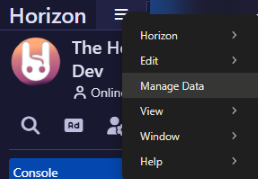
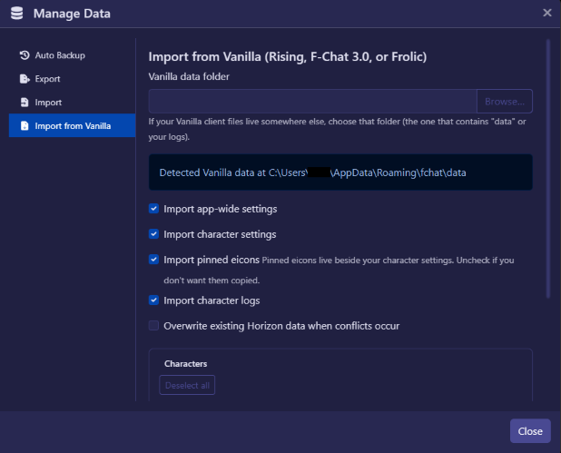
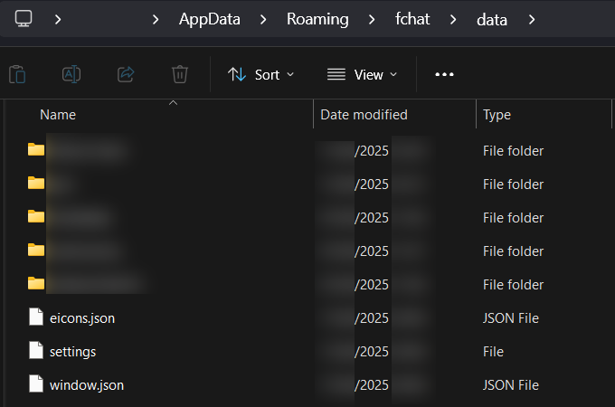
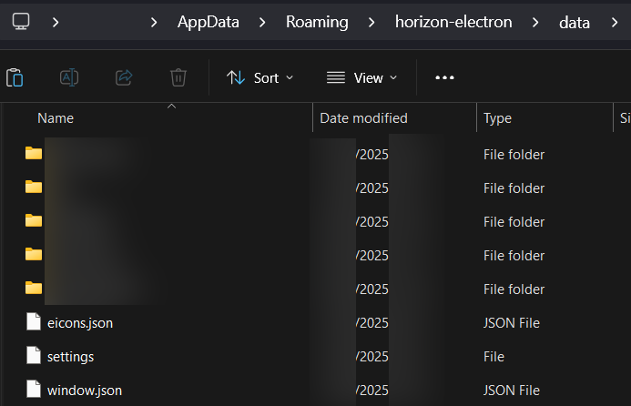

# Moving logs from Vanilla / Rising

## Folder locations

By _default_, F-Chat 3.0 and Rising store their data in the following folders:

| **Operating System** | **Data Path**                         |
| :------------------- | :------------------------------------ |
| Windows              | `%AppData%\fchat`                     |
| MacOS                | `~/Library/Application Support/fchat` |
| Linux                | `~/.config/fchat`                     |

By default, Horizon stores its data in the following folders:

| **Operating System** | **Data Path**                                    |
| :------------------- | :----------------------------------------------- |
| Windows              | `%AppData%\horizon-electron`                     |
| MacOS                | `~/Library/Application Support/horizon-electron` |
| Linux                | `~/.config/horizon-electron`                     |

These folders might be hidden by default, so you may need to enable a setting to display hidden folders in your file explorer.

> [!INFO]
> On Windows, you can easily go to your user's AppData folder by typing `%AppData%` (percent signs included) in File Explorer's address bar.

## How to move your logs

Currently, there's two ways of moving your logs over: using the built-in importer, or manually copying the log files. The importer requires less work from you and is our recommended way of doing it.

> [!TIP]
> Using the **web client** in your browser instead of a desktop install? Its logs live in browser storage, not on disk. See [Importing from the F-Chat web client](./guides/f-porter.md) for how to pull those into a Horizon export with the F-Porter userscript.

### With the Importer (Recommended)

Horizon will automatically prompt you to import your data when you first launch it, if it detects compatible Vanilla client data. However, to do it manually:

1. Open the **menu** (the ☰ icon in the top-left) and go to `Horizon → Manage Data`
   
   - (On Mac, you'll need to click the `Horizon` app menu instead)
2. Select the "Import from Vanilla" tab
   
3. (Optional) If Horizon can't find your Vanilla data automatically, click "Browse…" to manually select the folder
4. Choose which data to import:
   - App-wide settings
   - Character settings
   - Pinned eicons
   - Character logs
5. Check "Overwrite existing Horizon data when conflicts occur" if you want to replace existing data, otherwise new data will be merged
6. Select which characters to include
7. Click "Import selected data" to complete the import

### Manually

Inside the `fchat` folder there should be a folder called `data`, here you should see folders for all your characters' logs:

> [!INFO]
> Though this screenshot is from Windows, the process should be the same for other platforms too. Just mind the different folder names in the tables above.

> [!INFO]
> No character folders in the F-chat data folder?
> Check that you haven't changed the log save location in the settings: ⚙️ > F-Chat > Change log location.

Horizon uses the same kind of folder structure, so if you have already started the app once, inside the `horizon-electron` folder you should also find a `data` folder. You can simply copy the folders for your characters from Rising's `data` folder into Horizon's `data` folder, and if you restart Horizon it should load the logs like usual.

> [!WARNING]
> Please don't copy over files like `eicons.json`, `window.json` or `settings`. The formats they're in might not be compatible with current versions of Horizon and could break things.
