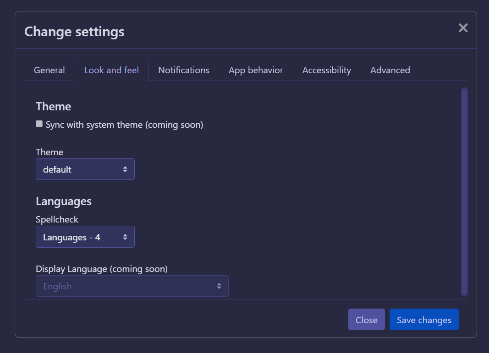

# Quality of life changes

> [!INFO]
> This page is still a major work in progress, or a stub.

Horizon's goal is to offer more than just bugfixes over Rising and F-Chat 3.0, we also want to bring the experience of using F-Chat into the modern era, with more comforts and better integration into modern desktop use.

Come from 3.0, or you don't even know what a "Rising" is? Take a look at [what else you're getting](rising).

## Settings menu

Ever used Rising or the standalone 3.0, and noticed how all the settings are just thrown around the place?

 

*Bam!* Settings menu.

As of writing, all of the settings in the character-specific settings screen (the one you'll see underneath the place you set your status once you're signed in) haven't been moved to this screen; we want to ease people in first. All of our fellow altaholics can rest assured, the annoying ones you'd normally get sick of having to change for all your characters (like the font size, or the notification sounds) are going to be _global_ settings soon. That way they'll be the same across the board.

## Message drafts

## Better on Windows

## Better on Linux!

## ...Better on Mac too!

## More keyboard shortcuts

## So many old bugs squashed

## And so much more planned...
